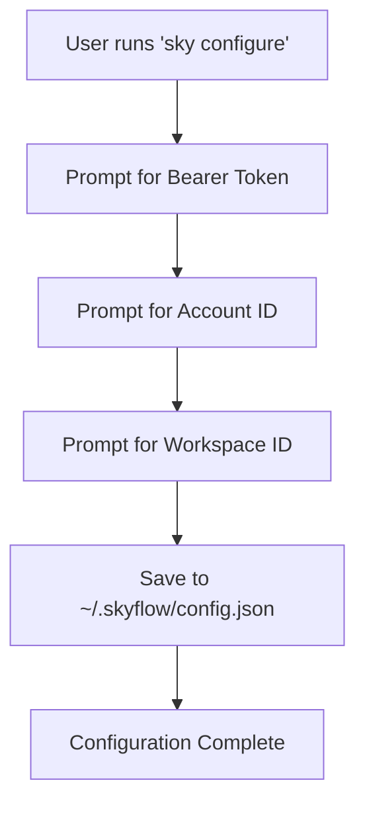
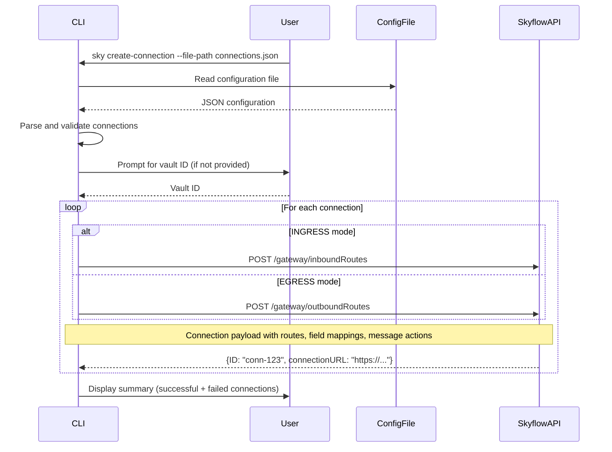
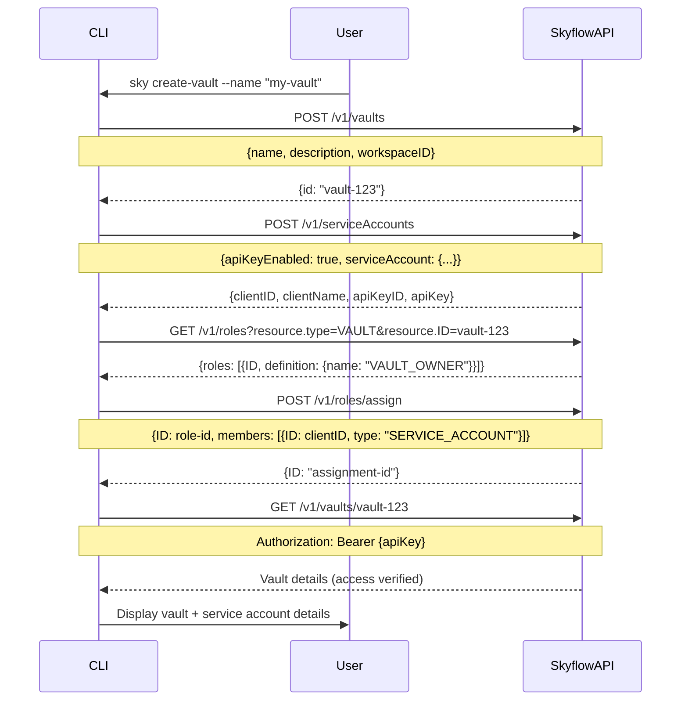
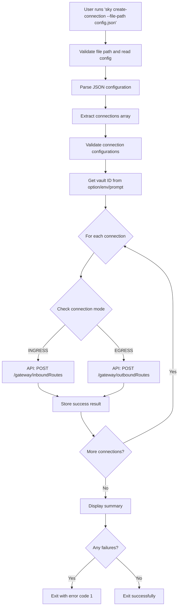

# Skyflow CLI API Documentation

This document describes the Skyflow REST API endpoints used by the Sky CLI tool and the sequence of API calls for each command.

## Base Configuration

- **Base URL**: `https://manage.skyflowapis.com/v1`
- **Authentication**: Bearer token authentication
- **Required Headers**:
  - `Authorization: Bearer {token}`
  - `X-SKYFLOW-ACCOUNT-ID: {accountId}`
  - `Content-Type: application/json`

## API Endpoints

### 1. Create Vault
**Endpoint**: `POST /v1/vaults`  
**Purpose**: Creates a new Skyflow vault

**Request Body**:
```json
{
  "name": "string",
  "description": "string",
  "workspaceID": "string",
  "vaultSchema": {}, // Optional: Proprietary JSON document specific to Skyflow
  "templateID": "string" // Optional: Template ID (alternative to vaultSchema)
}
```

**Response**:
```json
{
  "id": "vault-id-string"
}
```

**Used in**: `create-vault` command (`src/utils/api.ts:62`)

### 2. Create Service Account
**Endpoint**: `POST /v1/serviceAccounts`  
**Purpose**: Creates a service account with API key enabled

**Request Body**:
```json
{
  "apiKeyEnabled": true,
  "serviceAccount": {
    "name": "string",
    "description": "string"
  }
}
```

**Response**:
```json
{
  "clientID": "string",
  "clientName": "string", 
  "apiKeyID": "string",
  "apiKey": "string"
}
```

**Used in**: `create-vault` command with `--create-service-account` flag (`src/utils/api.ts:122`)

### 3. Get Vault Roles
**Endpoint**: `GET /v1/roles?resource.type=VAULT&resource.ID={vaultId}`  
**Purpose**: Retrieves all roles available for a specific vault

**Query Parameters**:
- `resource.type`: `VAULT`
- `resource.ID`: The vault ID

**Response**:
```json
{
  "roles": [
    {
      "ID": "string",
      "definition": {
        "name": "string",
        "displayName": "string", 
        "description": "string"
      }
    }
  ]
}
```

**Used in**: `create-vault` command to find `VAULT_OWNER` role (`src/utils/api.ts:158`)

### 4. Assign Role to Service Account
**Endpoint**: `POST /v1/roles/assign`  
**Purpose**: Assigns a role to a service account

**Request Body**:
```json
{
  "ID": "role-id-string",
  "members": [
    {
      "ID": "service-account-client-id",
      "type": "SERVICE_ACCOUNT"
    }
  ]
}
```

**Response**:
```json
{
  "ID": "assignment-id-string"
}
```

**Used in**: `create-vault` command to assign `VAULT_OWNER` role (`src/utils/api.ts:189`)

### 5. Verify Vault Access
**Endpoint**: `GET /v1/vaults/{vaultId}`  
**Purpose**: Verifies that a service account has access to a vault

**Headers** (different from standard):
- `Authorization: Bearer {apiKey}` (uses service account API key)
- `X-SKYFLOW-ACCOUNT-ID: {accountId}`

**Response**: 
- Success: Returns vault details
- Failure: Returns error (used to verify access)

**Used in**: `create-vault` command to verify service account access (`src/utils/api.ts:218`)

### 6. Create Connection (Inbound Routes)
**Endpoint**: `POST /gateway/inboundRoutes`  
**Purpose**: Creates inbound connection routes for data ingress

**Request Body**:
```json
{
  "name": "string",
  "description": "string",
  "vaultID": "string",
  "mode": "INGRESS",
  "authMode": "NOAUTH|MTLS|SHAREDKEY",
  "baseURL": "string",
  "denyPassThrough": boolean,
  "formEncodedKeysPassThrough": boolean,
  "routes": [
    {
      "name": "string",
      "description": "string",
      "path": "string",
      "method": "string",
      "contentType": "JSON|XML|X_WWW_FORM_URLENCODED|X_MULTIPART_FORM_DATA|UNKNOWN_CONTENT",
      "soapAction": "string",
      "mleType": "NOT_REQUIRED|MANDATORY",
      "url": [],
      "requestBody": [],
      "responseBody": [],
      "requestHeader": [],
      "responseHeader": [],
      "queryParams": [],
      "preFieldRequestMessageActions": [],
      "postFieldRequestMessageActions": [],
      "preFieldResponseMessageActions": [],
      "postFieldResponseMessageActions": [],
      "tableUpsertInfo": []
    }
  ]
}
```

**Response**:
```json
{
  "ID": "connection-id-string",
  "connectionURL": "https://connection-url"
}
```

**Used in**: `create-connection` command for INGRESS mode connections (`src/utils/api.ts:253`)

### 7. Create Connection (Outbound Routes)
**Endpoint**: `POST /gateway/outboundRoutes`  
**Purpose**: Creates outbound connection routes for data egress

**Request Body**: Same structure as inbound routes with `"mode": "EGRESS"`

**Response**: Same structure as inbound routes

**Used in**: `create-connection` command for EGRESS mode connections (`src/utils/api.ts:253`)

### Field Mapping Structure

Both inbound and outbound routes support detailed field mapping configurations:

```json
{
  "action": "NOT_SELECTED|TOKENIZATION|DETOKENIZATION|ENCRYPTION",
  "fieldName": "string",
  "table": "string",
  "column": "string",
  "dataSelector": "string",
  "dataSelectorRegex": "string",
  "transformFormat": "string",
  "encryptionType": "string",
  "redaction": "DEFAULT|REDACTED|MASKED|PLAIN_TEXT",
  "functionName": "string",
  "functionInfo": {
    "deploymentID": "string",
    "method": "string",
    "template": "NO_TEMPLATE|HTTP_TEMPLATE"
  },
  "sourceRegex": "string",
  "transformedRegex": "string"
}
```

### Message Action Structure

Routes support message actions for encryption, decryption, signing, and verification:

```json
{
  "type": "NOACTION|ENCRYPTION|DECRYPTION|SIGN|VERIFY|FIND_AND_REPLACE",
  "action": "string",
  "keyEncryptionAlgo": "string",
  "contentEncryptionAlgo": "string",
  "signatureAlgorithm": "string",
  "sourceRegex": "string",
  "transformedRegex": "string",
  "target": "string"
}
```

### Table Upsert Information

```json
{
  "table": "string",
  "column": "string"
}
```

## Command Flows

### Configure Command Flow

The `configure` command (`src/commands/configure.ts`) does not make any API calls. It only:

1. Prompts user for credentials (Bearer Token, Account ID, Workspace ID)
2. Saves configuration to `~/.skyflow/config.json`



### Create Vault Command Flow

The `create-vault` command (`src/commands/createVault.ts`) executes the following API sequence:

```mermaid
flowchart TD
    A[User runs 'sky create-vault'] --> B[Load config & validate options]
    B --> C[API: POST /v1/vaults]
    C --> D{Create service account?}
    D -->|Yes| E[API: POST /v1/serviceAccounts]
    D -->|No| J[Display vault info]
    E --> F[API: GET /v1/roles?resource.type=VAULT]
    F --> G[Find VAULT_OWNER role]
    G --> H[API: POST /v1/roles/assign]
    H --> I[API: GET /v1/vaults/{vaultId} - Verify access]
    I --> J[Display complete result]
```

#### Detailed API Sequence for Create Vault:

1. **Create Vault** (`src/utils/api.ts:31-117`)
   - **Call**: `POST /v1/vaults`
   - **Data Flow**: User options → Request payload → Vault ID response
   - **Input**: name, description, workspaceID, optional schema/template
   - **Output**: vaultID

2. **Create Service Account** (if `--create-service-account` is true) (`src/utils/api.ts:119-146`)
   - **Call**: `POST /v1/serviceAccounts`
   - **Data Flow**: Vault name → Service account creation → Credentials response
   - **Input**: Service account name derived from vault name
   - **Output**: clientID, clientName, apiKeyID, apiKey

3. **Get Vault Roles** (`src/utils/api.ts:148-181`)
   - **Call**: `GET /v1/roles?resource.type=VAULT&resource.ID={vaultId}`
   - **Data Flow**: Vault ID → Role query → Available roles list
   - **Input**: vaultID from step 1
   - **Output**: Array of roles, specifically looking for `VAULT_OWNER`

4. **Assign Role** (`src/utils/api.ts:183-210`)
   - **Call**: `POST /v1/roles/assign`
   - **Data Flow**: Role ID + Service Account ID → Role assignment → Assignment confirmation
   - **Input**: VAULT_OWNER role ID + clientID from service account
   - **Output**: Assignment ID

5. **Verify Access** (`src/utils/api.ts:212-232`)
   - **Call**: `GET /v1/vaults/{vaultId}` (using service account API key)
   - **Data Flow**: Service account credentials → Vault access test → Access confirmation
   - **Input**: vaultID + service account apiKey
   - **Output**: Boolean success/failure

## Data Flow Between API Calls

### Create Connection Flow:



### Create Vault with Service Account Flow:



### Create Connection Command Flow

The `create-connection` command (`src/commands/createConnection.ts`) executes the following sequence:



#### Detailed API Sequence for Create Connection:

1. **File Validation and Parsing** (`src/commands/createConnection.ts:34-84`)
   - **Input**: Configuration file path from `--file-path` option
   - **Process**: Check file existence, read content, parse JSON
   - **Output**: Parsed configuration object

2. **Connection Array Extraction** (`src/commands/createConnection.ts:72-84`)
   - **Input**: Parsed configuration (array or object with connections property)
   - **Process**: Extract connections array, validate structure
   - **Output**: Array of connection configurations

3. **Vault ID Resolution** (`src/commands/createConnection.ts:46-52`)
   - **Input**: `--vault-id` option, `SKYFLOW_VAULT_ID` env var, or interactive prompt
   - **Process**: Use provided vault ID or prompt user
   - **Output**: Vault ID string

4. **Connection Creation Loop** (`src/commands/createConnection.ts:134-175`)
   - **For each connection**:
     - **Input**: Connection configuration with routes
     - **API Call**: `POST /gateway/inboundRoutes` or `POST /gateway/outboundRoutes`
     - **Process**: Send connection payload based on mode (INGRESS/EGRESS)
     - **Output**: Connection ID and URL or error message

5. **Result Summary** (`src/commands/createConnection.ts:178-203`)
   - **Input**: Array of results (success/failure for each connection)
   - **Process**: Count successful and failed connections, display summary
   - **Output**: Summary statistics and exit code

## Error Handling

All API calls implement comprehensive error handling:

- **Axios errors**: HTTP status codes and response data are captured
- **Network errors**: Connection failures are handled gracefully  
- **Validation errors**: Request validation happens before API calls
- **Response validation**: API responses are validated for expected structure

Example error response handling (`src/utils/api.ts:112-116`):
```typescript
if (axios.isAxiosError(error) && error.response) {
  throw new Error(`Vault creation failed: ${error.response.status} - ${JSON.stringify(error.response.data)}`);
}
```

## Configuration Management

The CLI uses a persistent configuration stored in `~/.skyflow/config.json`:

```json
{
  "bearerToken": "your-bearer-token",
  "accountId": "your-account-id", 
  "workspaceID": "your-workspace-id"
}
```

This configuration is:
- Set via the `configure` command
- Loaded automatically before API operations
- Used to populate authentication headers and default workspace ID

## Environment Variables Output

After successful vault creation, the CLI provides environment variables for easy integration:

```bash
export SKYFLOW_VAULT_ID=vault-123
export SKYFLOW_CLUSTER_ID=cluster-456
export SKYFLOW_VAULT_URL=https://vault-url
export SKYFLOW_WORKSPACE_ID=workspace-789
export SKYFLOW_SERVICE_ACCOUNT_ID=sa-client-id
export SKYFLOW_API_KEY=sa-api-key
```

These variables can be used directly in applications that integrate with the created Skyflow vault.

## Connection Configuration Examples

### Simple Inbound Connection

```json
{
  "connections": [
    {
      "name": "api-gateway",
      "description": "Main API gateway connection",
      "mode": "INGRESS",
      "vaultID": "vault-123",
      "authMode": "NOAUTH",
      "routes": [
        {
          "name": "user-data",
          "description": "User data ingestion route",
          "path": "/api/users",
          "method": "POST",
          "contentType": "JSON",
          "mleType": "NOT_REQUIRED",
          "requestBody": [
            {
              "action": "TOKENIZATION",
              "fieldName": "email",
              "table": "users",
              "column": "email",
              "dataSelector": "$.email",
              "redaction": "DEFAULT"
            }
          ],
          "responseBody": [],
          "preFieldRequestMessageActions": [],
          "postFieldRequestMessageActions": [],
          "preFieldResponseMessageActions": [],
          "postFieldResponseMessageActions": [],
          "tableUpsertInfo": []
        }
      ]
    }
  ]
}
```

### Complex Connection with Encryption and Field Mappings

```json
{
  "connections": [
    {
      "name": "secure-webhook",
      "description": "Secure webhook with encryption",
      "mode": "EGRESS",
      "vaultID": "vault-456",
      "authMode": "MTLS",
      "baseURL": "https://api.example.com",
      "routes": [
        {
          "name": "secure-data-export",
          "description": "Export encrypted data",
          "path": "/export",
          "method": "POST",
          "contentType": "JSON",
          "mleType": "MANDATORY",
          "requestBody": [
            {
              "action": "DETOKENIZATION",
              "fieldName": "userId",
              "table": "users",
              "column": "user_id",
              "dataSelector": "$.user.id",
              "redaction": "PLAIN_TEXT"
            }
          ],
          "preFieldRequestMessageActions": [
            {
              "type": "ENCRYPTION",
              "action": "encrypt-payload",
              "keyEncryptionAlgo": "RSA-OAEP",
              "contentEncryptionAlgo": "AES-GCM",
              "target": "request.body"
            }
          ],
          "postFieldRequestMessageActions": [],
          "preFieldResponseMessageActions": [],
          "postFieldResponseMessageActions": [
            {
              "type": "VERIFY",
              "action": "verify-signature",
              "signatureAlgorithm": "RS256",
              "target": "response.body"
            }
          ],
          "tableUpsertInfo": [
            {
              "table": "audit_log",
              "column": "export_timestamp"
            }
          ]
        }
      ]
    }
  ]
}
```