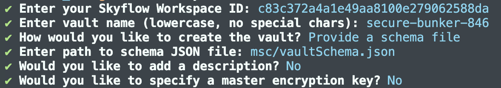

# Skyflow CLI (sky)

> **⚠️ Warning:** This CLI is experimental and unsupported. Use it at your own risk. Contributions and feedback are welcome, but no guarantees are provided for stability or support.

A command-line interface for interacting with the Skyflow data privacy platform. This CLI allows you to manage vaults, service accounts, and other Skyflow resources directly from your terminal.

## Features

- Create and manage vaults
- Create and manage service accounts
- Assign roles to service accounts
- Insert sensitive data into vault tables
- Detect and redact sensitive data (PII/PHI) using Skyflow Detect API
- Restore original values from tokenized text
- Interactive prompts for missing options with smart defaults
- Automatic persistence of last-used vault configuration

## Installation

### Local Development Installation

To use sky-cli, clone the repo from GitHub and then do a local npm installation. Note that you will need to have Node.js installed and configured, see package.json for dependencies.

```bash
# Clone this repository. Make sure the URL is correct.
git clone https://github.com/SkyflowFoundry/sky_cli.git
cd sky-cli

# Install dependencies
npm install

# Build the CLI
npm run build

# Make the compiled file executable
chmod +x dist/index.js

# Install the cloned CLI globally with npm
npm i -g .
```

## Configuration

Before using the CLI, you need to configure it with your Skyflow credentials.

### For Vault Management Commands

For commands like `create-vault`, run:

```bash
sky configure
```

You will be prompted to enter:

1. Your Skyflow Bearer Token
2. Your Skyflow Account ID

The CLI will then automatically fetch your available workspaces and:

- If you have only one workspace, it will be selected automatically
- If you have multiple workspaces, you'll be prompted to choose one

You can also set these as environment variables:

```bash
export SKYFLOW_BEARER_TOKEN="your-bearer-token"
export SKYFLOW_ACCOUNT_ID="your-account-id"
export SKYFLOW_WORKSPACE_ID="your-workspace-id"  # Optional - will be fetched if not set
```

### For Data Operations Commands (Insert, Deidentify, Reidentify)

These commands use the Skyflow Node.js SDK and support multiple authentication methods (in priority order):

1. **API Key** (Recommended):

   ```bash
   export SKYFLOW_API_KEY="your-api-key"
   ```

2. **Service Account Credentials File**:

   ```bash
   export SKYFLOW_CREDENTIALS_PATH="/path/to/credentials.json"
   ```

3. **Service Account Credentials JSON String**:

   ```bash
   export SKYFLOW_CREDENTIALS='{"clientID":"...","clientName":"...","tokenURI":"...","keyID":"...","privateKey":"..."}'
   ```

4. **Bearer Token** (from `sky configure`):

   ```bash
   # Uses the bearer token stored in ~/.skyflow/config.json
   ```

#### Vault Configuration

For vault ID and cluster ID, the CLI provides flexible options (in priority order):

1. **Command-line options**: `--vault-id` and `--cluster-id`
2. **Environment variables**: `SKYFLOW_VAULT_ID` and `SKYFLOW_VAULT_URL`
3. **Interactive prompts**: If not provided, the CLI will prompt you interactively, offering the last-used vault as a default

The CLI automatically remembers your last-used vault details in `~/.skyflow/config.json`, so you only need to enter them once. When you create a vault with `sky create-vault`, those details are automatically saved for future use.

**Optional**: Set these environment variables to skip prompts:

```bash
export SKYFLOW_VAULT_ID="your-vault-id"
export SKYFLOW_VAULT_URL="https://your-cluster.vault.skyflowapis.com"
# OR
export SKYFLOW_VAULT_ID="your-vault-id"
# and use --cluster-id flag when needed
```

## Usage

### Creating a Vault

The most basic way to create a vault is to run:

```bash
sky create-vault
```

This will prompt you for all necessary information.

### Creating a Vault with Options

You can also specify options directly, for example:

```bash
sky create-vault --name testvault --description "My test vault"
```

#### Available Options

- `--name`: Name for the vault (lowercase, no special characters)
- `--template`: Template to use for the vault (supports snake_case and kebab-case)
- `--description`: Description for the vault
- `--master-key`: Master encryption key for the vault
- `--create-service-account`: Whether to create a service account (defaults to true)
- `--schema`: Path to JSON schema file for the vault
- `--workspace-id`: Workspace ID for the vault (required, but can be set via configuration)
- `--verbose`: Enable detailed logging for debugging purposes

#### Available Templates

When running interactively (`sky create-vault`), the CLI will fetch and display all available templates from your Skyflow account. You can also specify a template name directly using the `--template` option with template names like `customer_identity`, `payment`, `pii_data`, `detect`, etc.

#### Examples

Using a template:

```bash
sky create-vault --name testvault --template customer_identity --description "Customer identity vault"
```

Using a schema file:

```bash
sky create-vault --name testvault --schema /path/to/schema.json
```

Simplest form:

```bash
sky create-vault
```



### Inserting Data into a Vault

Insert sensitive data into a vault table and optionally receive tokens:

```bash
sky insert --table credit_cards --data '{"card_number":"4111111111111111","cvv":"123"}' --return-tokens
```

#### Insert Command Options

- `--table <name>`: Table name to insert data into (required)
- `--data <json>`: JSON data to insert (can also pipe from stdin)
- `--return-tokens`: Return tokens for inserted data (default: false)
- `--continue-on-error`: Continue if some records fail (default: false)
- `--upsert-column <name>`: Column name for upsert operations
- `--vault-id <id>`: Vault ID (or set SKYFLOW_VAULT_ID)
- `--cluster-id <id>`: Cluster ID (or set SKYFLOW_VAULT_URL)
- `--environment <env>`: Environment: PROD, SANDBOX, STAGE, DEV (default: PROD)
- `--verbose`: Enable detailed logging

#### Insert Command Examples

Insert a single record:

```bash
sky insert --table users --data '{"email":"user@example.com","ssn":"123-45-6789"}'
```

Insert multiple records:

```bash
sky insert --table users --data '[{"email":"user1@example.com"},{"email":"user2@example.com"}]'
```

Insert from stdin:

```bash
echo '{"card_number":"4111111111111111"}' | sky insert --table credit_cards --return-tokens
```

Upsert based on email column:

```bash
sky insert --table users --data '{"email":"user@example.com","name":"John Doe"}' --upsert-column email
```

### Deidentifying Sensitive Data

Detect and redact sensitive information (PII/PHI) from text using Skyflow Detect API:

```bash
sky deidentify --text "My SSN is 123-45-6789 and my email is user@example.com"
```

#### Deidentify Command Options

- `--text <string>`: Text to deidentify (can also pipe from stdin)
- `--entities <list>`: Comma-separated entity types to detect (e.g., SSN,CREDIT_CARD,EMAIL)
- `--token-type <type>`: Token format - vault_token (stored), entity_only (labels), entity_unique_counter (default: vault_token)
- `--output <format>`: Output format - text or json (default: text)
- `--vault-id <id>`: Vault ID (or set SKYFLOW_VAULT_ID)
- `--cluster-id <id>`: Cluster ID (or set SKYFLOW_VAULT_URL)
- `--environment <env>`: Environment: PROD, SANDBOX, STAGE, DEV (default: PROD)
- `--verbose`: Enable detailed logging

#### Supported Entity Types

SSN, CREDIT_CARD, EMAIL, PHONE_NUMBER, NAME, DOB, ACCOUNT_NUMBER, DRIVER_LICENSE, PASSPORT_NUMBER, and many more.

#### Deidentify Command Examples

Detect all default entities (SSN, CREDIT_CARD, EMAIL, PHONE_NUMBER, NAME, DOB):

```bash
sky deidentify --text "My SSN is 123-45-6789 and card is 4111-1111-1111-1111"
```

Detect specific entities only:

```bash
sky deidentify --text "Contact me at user@example.com or 555-1234" --entities EMAIL,PHONE_NUMBER
```

Use entity-only tokens (no vault storage):

```bash
sky deidentify --text "My SSN is 123-45-6789" --token-type entity_only
```

Pipe from file or command:

```bash
cat sensitive_data.txt | sky deidentify --entities SSN,EMAIL,CREDIT_CARD
```

JSON output for programmatic use:

```bash
sky deidentify --text "SSN: 123-45-6789" --output json
```

### Reidentifying Tokenized Data

Restore original values from tokenized text:

```bash
sky reidentify --text "My SSN is [SSN_abc123] and card is [CREDIT_CARD_xyz789]"
```

#### Reidentify Command Options

- `--text <string>`: Tokenized text to reidentify (can also pipe from stdin)
- `--plain-text <list>`: Comma-separated entities to return as plain text
- `--masked <list>`: Comma-separated entities to return masked (e.g., XXX-XX-1234)
- `--redacted <list>`: Comma-separated entities to keep redacted
- `--output <format>`: Output format - text or json (default: text)
- `--vault-id <id>`: Vault ID (or set SKYFLOW_VAULT_ID)
- `--cluster-id <id>`: Cluster ID (or set SKYFLOW_VAULT_URL)
- `--environment <env>`: Environment: PROD, SANDBOX, STAGE, DEV (default: PROD)
- `--verbose`: Enable detailed logging

#### Reidentify Command Examples

Reidentify all tokens as plain text:

```bash
sky reidentify --text "SSN: [SSN_abc123], Card: [CREDIT_CARD_xyz789]"
```

Return SSN as plain text, credit card as masked:

```bash
sky reidentify --text "SSN: [SSN_abc123], Card: [CREDIT_CARD_xyz789]" --plain-text SSN --masked CREDIT_CARD
```

Pipe from file:

```bash
cat tokenized_data.txt | sky reidentify --plain-text SSN,EMAIL
```

JSON output:

```bash
sky reidentify --text "[SSN_token] data" --output json
```

## Output

### Insert Command Output

The insert command displays:

- Number of records successfully inserted
- Skyflow IDs for inserted records
- Tokens for each field (if `--return-tokens` is used)
- Any errors that occurred during insertion

Example output:

```text
Insert completed successfully!

Inserted records:

Record 1:
  Skyflow ID: a8f3ed5d-55eb-4f32-bf7e-2dbf4b9d9097
  card_number: 5484-7829-1702-9110
  cardholder_name: b2308e2a-c1f5-469b-97b7-1f193159399b

Total records processed: 1
Successful: 1
Failed: 0
```

### Deidentify Command Output

The deidentify command displays:

- Processed text with sensitive data replaced by tokens
- Details about each detected entity (type, original value, token, position, confidence)
- Word and character counts

Example output:

```text
Deidentified Text:
────────────────────────────────────────────────────────────
My SSN is [SSN_0ykQWPA] and my card is [CREDIT_CARD_N92QAVa].
────────────────────────────────────────────────────────────

Detected 2 sensitive entities:

1. SSN
   Original: "123-45-6789"
   Token: SSN_0ykQWPA
   Position: 10-21
   Confidence: 93.8%

2. CREDIT_CARD
   Original: "4111 1111 1111 1111"
   Token: CREDIT_CARD_N92QAVa
   Position: 37-56
   Confidence: 90.5%

Word count: 9
Character count: 57
```

### Reidentify Command Output

The reidentify command displays the text with tokens replaced by original values (or masked/redacted based on options):

Example output:

```text
Reidentified Text:
────────────────────────────────────────────────────────────
My SSN is 123-45-6789 and my card is 4111 1111 1111 1111.
────────────────────────────────────────────────────────────

Original sensitive data has been restored.
```

### Vault Creation Output

Upon successful vault creation, the CLI will output:

- Vault details (name, description, ID, etc.)
- Service account details (if created)
- Environment variables for easy export

Example:

```bash
=== Vault Created Successfully ===

Name: testvault
Description: My test vault
Vault URL: (not yet populated)
Cluster ID: (not yet populated)
Vault ID: v123456
Service Account ID: sa123456
Service Account API Key: sky-xxxxxxx

Environment Variables:
export SKYFLOW_VAULT_ID=v123456
export SKYFLOW_CLUSTER_ID=
export SKYFLOW_VAULT_URL=
export SKYFLOW_WORKSPACE_ID=ws123456
export SKYFLOW_SERVICE_ACCOUNT_ID=sa123456
export SKYFLOW_API_KEY=sky-xxxxxxx
```

## License

MIT
